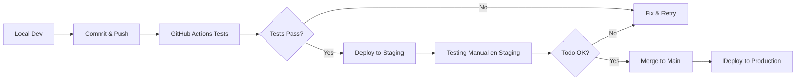

# 🌍 CONFIGURACIÓN DE AMBIENTES (Como Odoo/Shopify)

## PROBLEMA ACTUAL
Solo tienes:
- ✅ Local (desarrollo)
- ✅ Producción

**FALTA: Staging (pruebas antes de producción)**

---

## SOLUCIÓN: 3 AMBIENTES CON VERCEL (GRATIS)

### **1. DESARROLLO** (Local)
```bash
npm run dev
# http://localhost:5173
# DB: Supabase (proyecto de desarrollo)
```

### **2. STAGING** (Preview en Vercel)
```bash
git checkout -b staging
git push origin staging

# Vercel auto-deploys to:
# https://azmol-stockerp-staging.vercel.app
```

**Variables de entorno en Vercel (Staging):**
- `VITE_SUPABASE_URL` → Mismo proyecto o proyecto de staging
- `VITE_SUPABASE_ANON_KEY` → Staging key

### **3. PRODUCCIÓN** (Main branch)
```bash
git checkout main
git merge staging
git push origin main

# Vercel auto-deploys to:
# https://azmol-stockerp.vercel.app
```

---

## 🔄 WORKFLOW PROFESIONAL (Como Odoo/Shopify)



---

## 📋 CONFIGURACIÓN EN VERCEL

### **Paso 1: Crear Branch de Staging**
```bash
git checkout -b staging
git push -u origin staging
```

### **Paso 2: Configurar en Vercel**
```
Vercel Dashboard → Settings → Git
✅ Production Branch: main
✅ Enable Preview Deployments: ✓
```

### **Paso 3: Configurar Variables por Ambiente**

**Staging (Preview):**
- VITE_SUPABASE_URL = staging project
- VITE_SUPABASE_ANON_KEY = staging key

**Production:**
- VITE_SUPABASE_URL = production project
- VITE_SUPABASE_ANON_KEY = production key

---

## 🎯 NUEVO WORKFLOW DIARIO

### **Desarrollar Nueva Feature**
```bash
# 1. Crear branch
git checkout -b feature/nueva-funcion

# 2. Desarrollar y testear localmente
npm run test

# 3. Commit
git add .
git commit -m "Nueva función X"

# 4. Push y crear PR a staging
git push origin feature/nueva-funcion
```

### **Testing en Staging**
```bash
# GitHub → Create Pull Request → staging branch
# Vercel auto-genera preview URL

# Probar en: https://azmol-stockerp-git-feature-nueva-funcion.vercel.app

# Si todo OK:
git checkout staging
git merge feature/nueva-funcion
git push origin staging
```

### **Deploy a Producción**
```bash
# Solo cuando staging esté 100% probado
git checkout main
git merge staging
git push origin main

# Vercel auto-deploys a producción
```

---

## ✅ BENEFICIOS (Como Odoo/Shopify)

- ✅ **Nunca rompes producción**
- ✅ **Pruebas con datos reales en staging**
- ✅ **Rollback fácil** (revert en GitHub)
- ✅ **Preview URLs** para cada PR
- ✅ **CI/CD automático**
- ✅ **100% GRATIS** con Vercel

---

## 🚀 IMPLEMENTAR AHORA (10 minutos)

```bash
# 1. Crear staging branch
git checkout -b staging
git push -u origin staging

# 2. Configurar en Vercel
# Dashboard → Settings → Git → Production Branch = main

# 3. (Opcional) Crear proyecto Supabase de staging
# supabase.com → New Project → "azmol-stockerp-staging"

# 4. Actualizar variables en Vercel
# Settings → Environment Variables → Add por ambiente
```

**¿Listo?**
